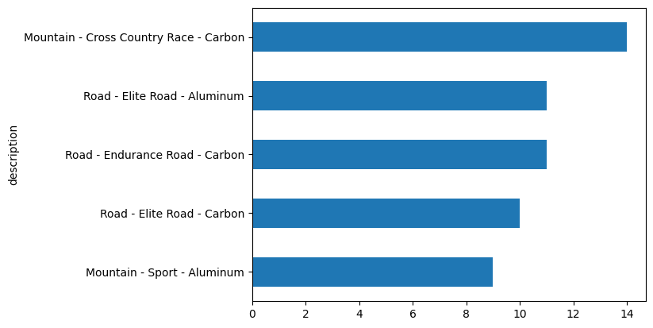
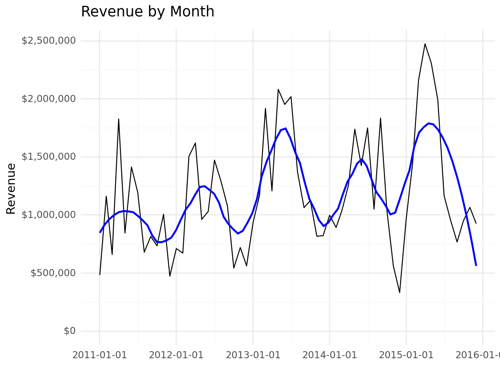
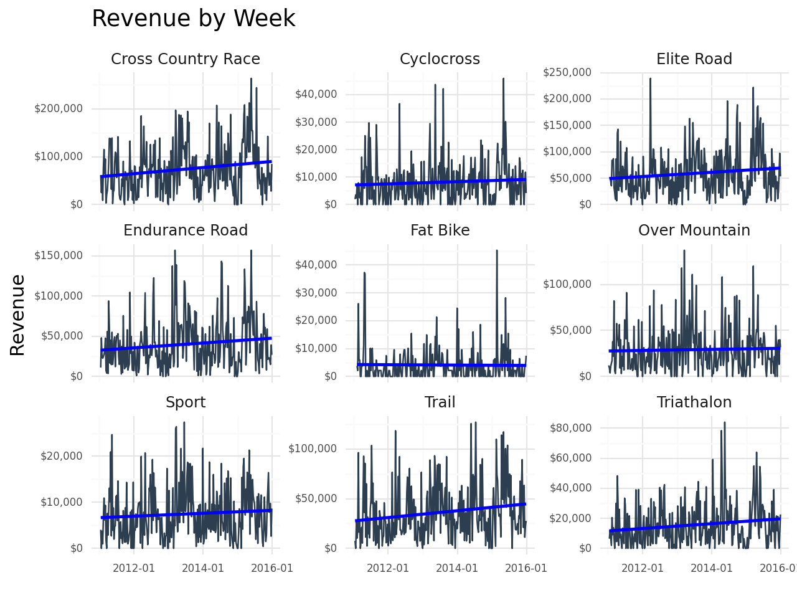
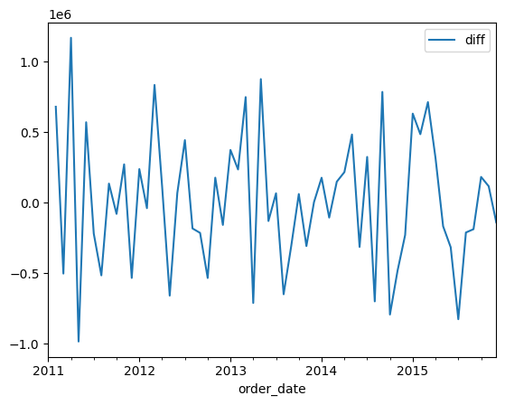
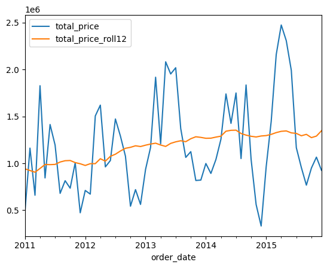
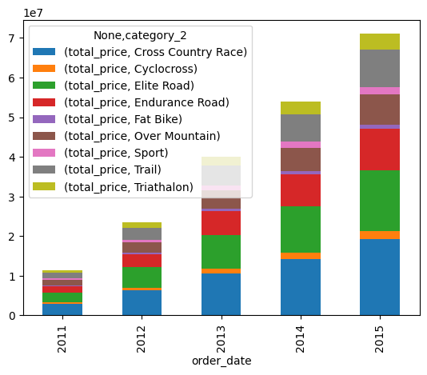
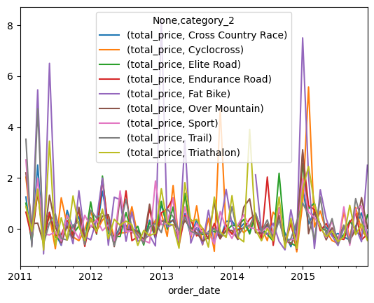
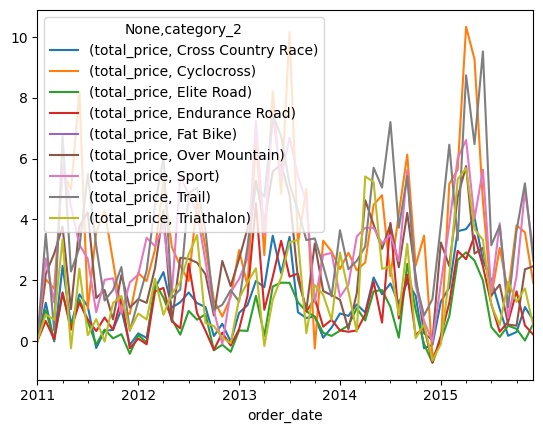

# Bike Forecast Automation 🚴‍♂️📊


**Project:** Automated Forecast System for a Bike Manufacturing Company  
**Purpose:** This system automates forecasting, reporting, and data analysis for senior management.  
**Technologies:** Python, Pandas, Matplotlib, Plotnine, SQLAlchemy, sktime, Papermill  

---

## 📌 Features

- **Automated Time Series Forecasting:** Generates forecasts for bike production and sales.
- **Data Wrangling and Transformation:** Cleans and prepares raw data for analysis.
- **Interactive Visualizations:** Provides insightful plots for revenue trends, category-wise sales, and more.
- **Advanced Analytics:** Includes rolling averages, cumulative sales, and percentage change analysis.
- **Pandas Profiling Report:** Generates a detailed exploratory data analysis (EDA) report.
- **Database Integration:** Stores raw and processed data in a SQLite database.
- **Report Automation:** Generates reports for senior management using templates.
- **Extensible Design:** Modular functions for data collection, summarization, and forecasting.

---

## ⚙️ Installation

### Step 1: Clone the Repository

```sh
git clone https://github.com/Rhodapeps/bike-forecast-automation.git
cd bike-forecast-automation
```

### Step 2: Set Up Conda Environment

```sh
conda env create -f environment_setup/01_conda_environment.yml
conda activate bike_forecast_automation
```

### Step 3: Install Required Extensions (Optional)

For an enhanced development experience, install the following VSCode extensions:

- **Required:** Python, Jupyter, Code Runner
- **Optional:** Markdown All in One, Excel Viewer, vscode-icons

---

## 🛠 Usage

### Step 1: Prepare the Data

Place the raw data files (`bikes.xlsx`, `bikeshops.xlsx`, `orderlines.xlsx`) in the `data/raw/` directory.

### Step 2: Run the Analysis

Execute the main analysis script to process the data and generate visualizations:

```sh
python analysis/sales_analysis.py
```

### Step 3: View Reports

Generated reports and visualizations will be saved in the `reports/` and `data/data_wrangled/` directories.

---

## 📊 Visualizations and Reports

### 1. **Top 5 Bikes by Frequency**

This bar chart shows the top 5 most frequently sold bikes:

```python
top5_bikes_series = bikes_df['description'].value_counts().nlargest(5)
fig = top5_bikes_series.plot(kind="barh")
fig.invert_yaxis()
plt.show()
```



---

### 2. **Revenue by Month**

This visualization shows the monthly revenue trend:

```python
sales_by_month_df.plot(x='order_date', y='total_price')
plt.show()
```



---

### 3. **Revenue by Week**

A facet plot showing weekly revenue trends by category:

```python
ggplot(
    mapping=aes(x='order_date', y='total_price'),
    data=sales_by_month_cat_2
) + \
    geom_line(color="#2c3e50") + \
    geom_smooth(method="lm", se=False, color="blue") + \
    facet_wrap(
        facets="category_2",
        ncol=3,
        scales="free_y"
    ) + \
    labs(title="Revenue by Week", x="", y="Revenue")
```



---

### 4. **Sales Difference from Previous Period**

This analysis calculates the difference in sales compared to the previous period:

```python
sales_by_month_df['sales_diff'] = sales_by_month_df['total_price'].diff()
sales_by_month_df.plot(x='order_date', y='sales_diff')
plt.show()
```



---

### 5. **Rolling Average of Category Sales**

This plot shows the rolling average of sales for each category:

```python
rolling_avg = sales_by_month_cat_2.groupby('category_2')['total_price'].rolling(window=4).mean().reset_index()
rolling_avg.plot(x='order_date', y='total_price')
plt.show()
```



---

### 6. **Cumulative Sales by Year**

This visualization shows the cumulative sales trend by year:

```python
cumulative_sales = df.groupby(df['order_date'].dt.year)['total_price'].cumsum()
cumulative_sales.plot()
plt.show()
```


---

### 7. **Cumulative Category Sales by Year (Stacked)**

This stacked bar chart shows cumulative sales by category and year:

```python
cumulative_category_sales = df.groupby(['category_2', df['order_date'].dt.year])['total_price'].cumsum()
cumulative_category_sales.unstack().plot(kind='bar', stacked=True)
plt.show()
```



---

### 8. **Category Sales Percentage Change Over Time**

This analysis calculates the percentage change in sales for each category over time:

```python
sales_pct_change = sales_by_month_cat_2.groupby('category_2')['total_price'].pct_change()
sales_pct_change.plot()
plt.show()
```



---

### 9. **Category Sales Percentage Change from Start**

This analysis calculates the percentage change in sales from the start for each category:

```python
sales_pct_change_start = sales_by_month_cat_2.groupby('category_2')['total_price'].apply(lambda x: x / x.iloc[0] - 1)
sales_pct_change_start.plot()
plt.show()
```



---

### 10. **Pandas Profiling Report**

A detailed exploratory data analysis (EDA) report is generated using Pandas Profiling.  
You can view the report by opening the following link in your browser:

[View Pandas Profiling Report]([http://](http://127.0.0.1:3000/reports/profile_report.html))


---

## 📂 Project Structure

```text
BIKE FORECAST AUTOMATION
├── analysis/                      # Analysis scripts
│   └── sales_analysis.py          # Main analysis script
├── data/                          # Raw & processed data
│   ├── raw/                       # Raw data files
│   ├── data_wrangled/             # Processed data files
├── environment_setup/             # Conda environment setup files
├── models/                        # Forecasting models
├── my_panda_extensions/           # Custom pandas extensions
├── notebooks/                     # Jupyter notebooks
├── reports/                       # Auto-generated reports
│   └── images/                    # Visualization images
├── sql_database/                  # SQL database scripts
├── time_series/                   # Time series analysis scripts
├── README.md                      # Documentation
├── requirements.txt               # Dependencies
├── .gitignore                     # Files ignored by Git
```

---

## 📄 License

This project is licensed under the MIT License.
